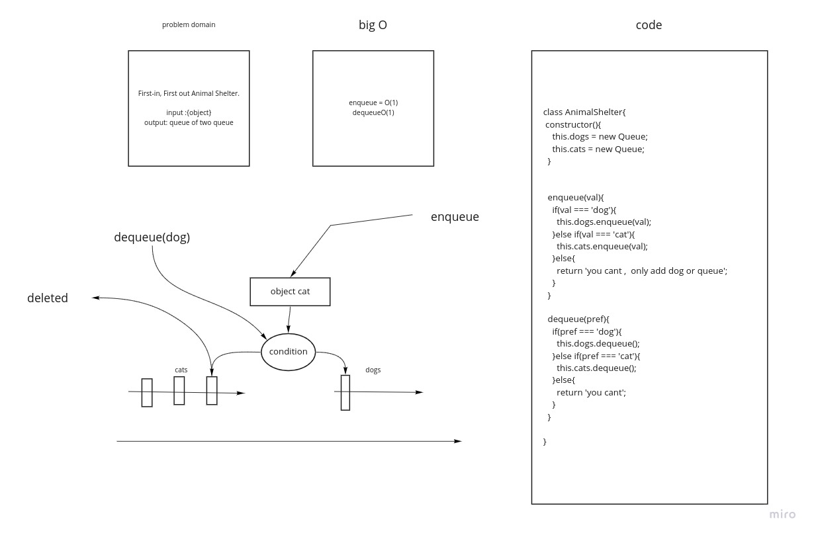

## Challenge
<!-- Description of the challenge -->

  ###  Create a class called AnimalShelter which holds only dogs and cats.
### The shelter operates using a first-in, first-out approach.
### Implement the following methods:
* enqueue
* dequeue

  * enqueue => dog or cat
  * dequeue => dog or cat

## Approach & Efficiency
  #### theres alot of logic and i like it

  # whitebord

  
