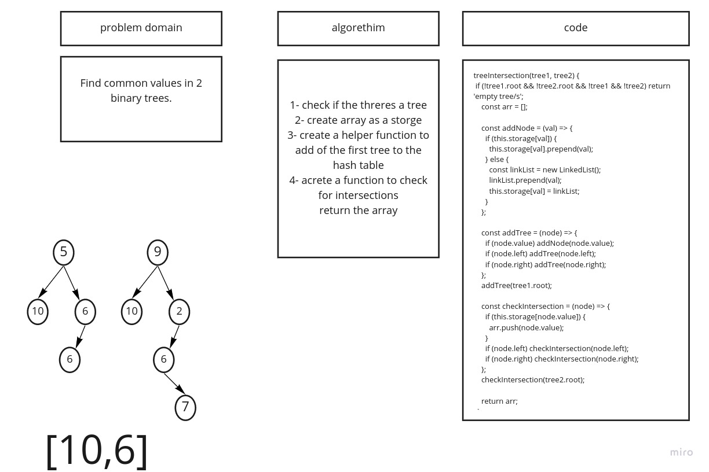

## Challenge

Create a Hash Table/Map and integrate Linked-List as data that goes in the Hash table.

## API

- `hash()` - takes in a key and hashes the key into a integer that is within the size of Map.

- `set()` - takes in a key AND value calls the hash method on the key, then sets the hashed key inside the map along with the value.

- `get()` - takes in key and checks the HashMap if the key exists and returns the value. If the value does not exists return null.

- `hash()` - takes in key and checks the HashMap if the key exists and returns a boolean.

## code challenges 31

## uml 

## code challenges 32 (tree Intersection)

## uml 

## code challenges 33 (join left)

## uml 

