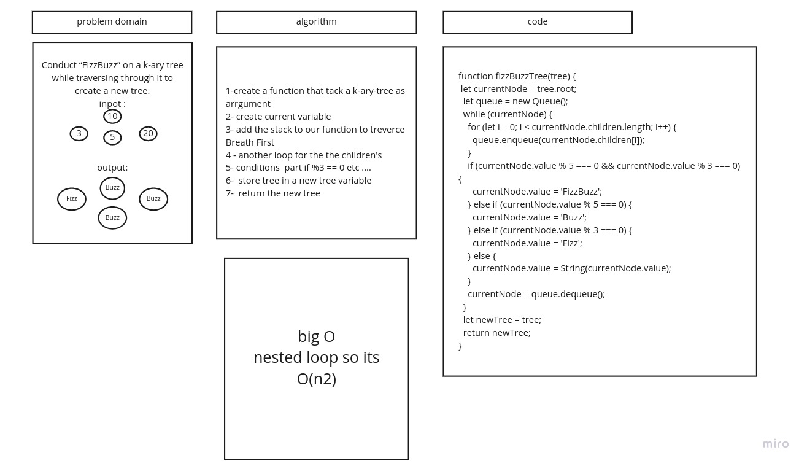

# Challenge Summary

######  Conduct “FizzBuzz” on a k-ary tree while traversing through it to create a new tree
 
## Whiteboard Process

## Approach & Efficiency
#### theres alot of logic and i like it

## Solution
i[img](./img/sl.jpg)
