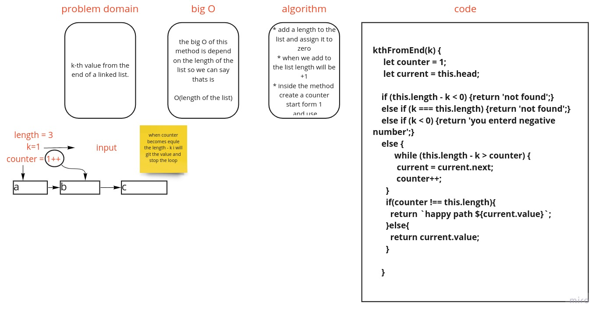

 Singly Linked List 3

### What is a Singly Linked List?
  * consists of nodes
  * each node has a value and a pointer to the next node (or null at the end of the list)
  * has a head (=start), a tail (=end) and a length
  * has no index like an Array
  * "singly" because only one connection to another node (the next one)
  * access has always to start from the start (O(N))
  * insertion is cheap (O(1))
  * deletion can be cheap (O(1) (head) or O(N) (tail)) 

## Challenge
<!-- Description of the challenge -->

  ###  create one method for the linked list

  * kthFromEnd => get the item by index from the tail

## Approach & Efficiency
  #### theres alot of logic and i like it

  # whitebord

  
