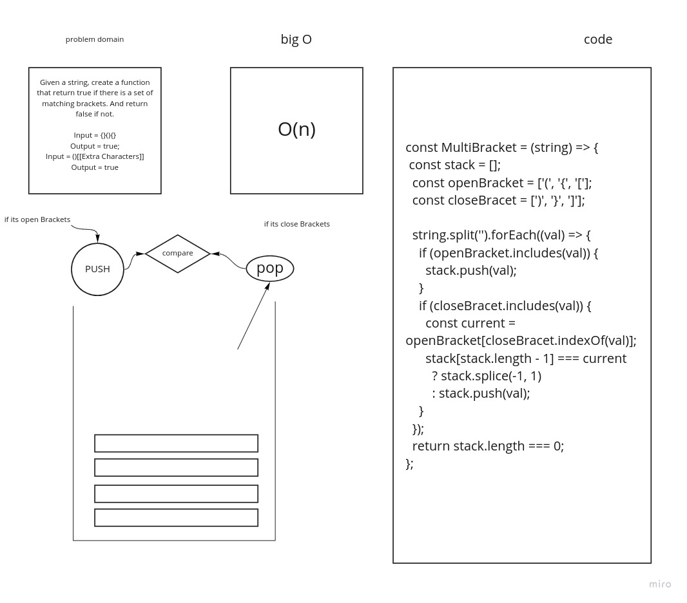

## Challenge
<!-- Description of the challenge -->

  ###  Given a string, create a function that return true if there is a set of matching brackets. And return false if not.

## Approach & Efficiency
  #### theres alot of logic and i like it

  # whitebord

  