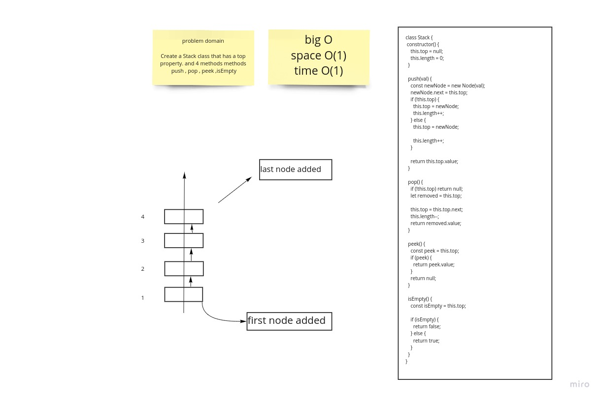
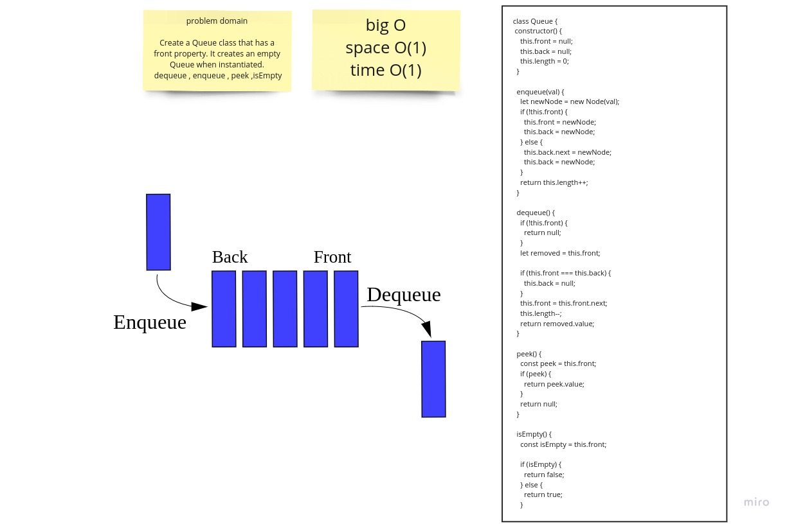

 Singly Linked List 3

### What is a stack?
  * s an ordered collection of items where the addition of new items and the removal of existing items always takes place at the same end. This end is commonly referred to as the “top.” The end opposite the top is known as the “base.”
### What is a queue?

  * A queue is an ordered collection of items where the addition of new items happens at one end, called the “rear,” and the removal of existing items occurs at the other end, commonly called the “front.” As an element enters the queue it starts at the rear and makes its way toward the front, waiting until that time when it is the next element to be removed.

## Challenge
 * Create a Stack class that has a top property. It creates an empty Stack when instantiated.
This object should be aware of a default empty value assigned to top when the stack is created.
The class should contain the following methods: push , pop , peek , isEmpty

  * Create a Queue class that has a front property. It creates an empty Queue when instantiated.
This object should be aware of a default empty value assigned to front when the queue is created.
The class should contain the following methods: enqueue , dequeue peek , isEmpty

## Approach & Efficiency
  #### theres alot of logic and i like it

  # whitebord

  

  