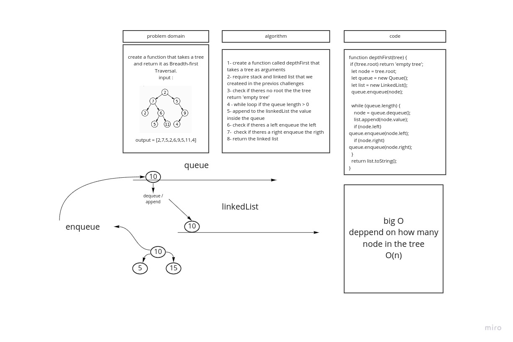

## Challenge
  #### Write a function called breadth first THAT takes a tree and return a Linked list sorted in a tree breadth 

 

## Approach & Efficiency
#### theres alot of logic and i like it

## UML 
