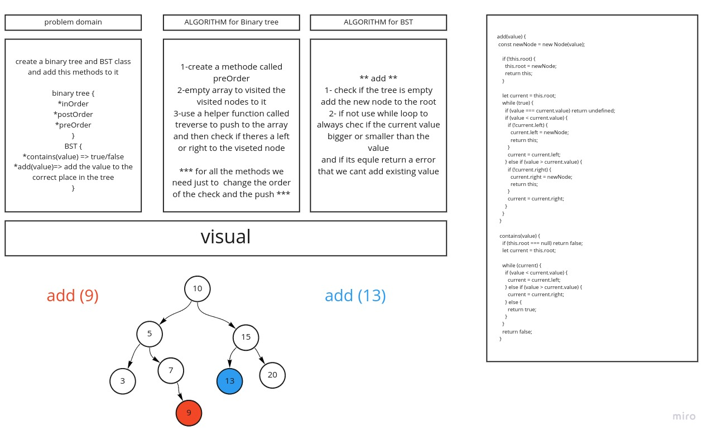

# Trees
 #### data strctrues that each node (parent) and with childs (left and right) 

## Challenge
  #### create a binary tree and BST class and add this methods to it

- binary tree {
  * inOrder 
  * postOrder
  * preOrder
}

- BST {
  * contains(value) => true/false
  * add(value)=> add the value to the correct place in the tree
}
 

## Approach & Efficiency
#### theres alot of logic and i like it

## UML 
